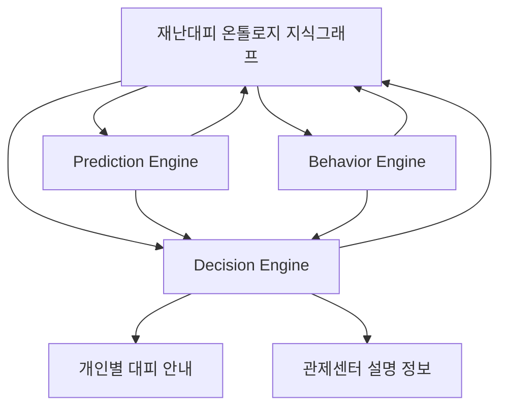
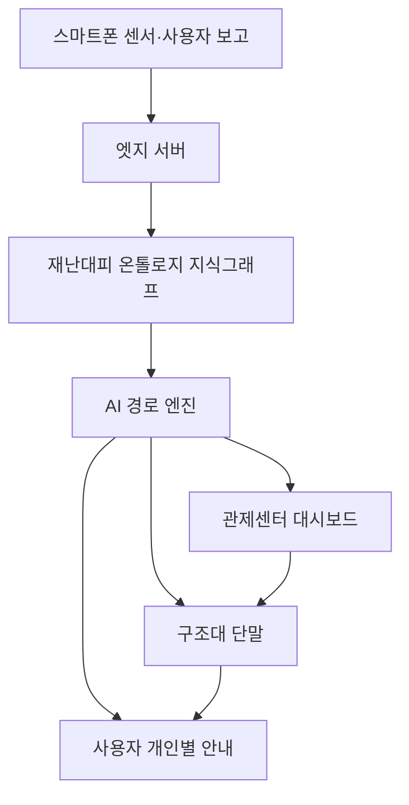
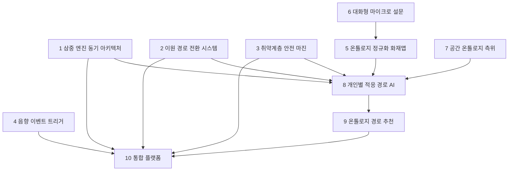

# FireNavi 온톨로지 기반 10대 특허출원 상세 자료

문서명: `ontology-patent.md`  
대상 기술: FireNavi 스마트폰·온톨로지·AI 기반 재난대피 플랫폼  
작성 목적: 특허 명세서 초안, 변리사 협의자료, 기술기획서, 투자자 설명자료, AI 챔피언 발표 보조자료로 활용  
핵심 방향: 기존 FireNavi 특허를 단순 경로 계산 기술이 아니라, 사람·공간·위험·센서·규정의 의미 관계를 이해하고 설명 가능한 개인별 재난대피 경로를 생성하는 온톨로지 기반 AI 재난안전 기술로 확장한다.

---

## 0. 전체 특허 포트폴리오 개요

FireNavi의 온톨로지 기반 특허 포트폴리오는 다음 10건으로 구성한다.

| 구분 | 특허명 | 핵심 보호 대상 |
|---|---|---|
| 1 | 온톨로지 공유 기반 삼중 엔진 동기 아키텍처 | Prediction·Behavior·Decision 엔진의 공통 의미체계 기반 동기 판단 |
| 2 | 온톨로지 기반 이원 경로 전환 시스템 | 주경로·대체경로의 의미 기반 생성과 상황별 자동 전환 |
| 3 | 취약계층 제약 온톨로지 기반 안전 마진 자동 적용 | 취약도·이동제약·감각제약에 따른 안전계수 자동 적용 |
| 4 | 음향 이벤트 온톨로지 기반 자동 재난 트리거 | 재난 경보음·비명·폭발음·구조요청음의 의미 분류와 자동 활성화 |
| 5 | 센서·인간보고 온톨로지 정규화 기반 화재맵 | 센서값과 사용자 보고를 의미 노드로 변환한 동적 위험지도 생성 |
| 6 | 사용자 상태 온톨로지 기반 대화형 마이크로 설문 | 사용자 유형과 감각 제약에 맞춘 재난 질의·응답 자동 조정 |
| 7 | 공간 온톨로지 기반 인프라프리 실내 다층 측위 | 스마트폰 위치 추정을 층·복도·계단·출구 의미 노드로 매핑 |
| 8 | 사용자·위험·공간 온톨로지 기반 개인별 적응 경로 AI | 개인 상태·위험·공간 제약 기반 맞춤형 대피 경로 생성 |
| 9 | 온톨로지 기반 개인별 재난 대피 경로 추천 시스템 | 사람·공간·위험·규정 지식그래프 기반 설명 가능한 경로 추천 |
| 10 | 스마트폰·온톨로지·AI 기반 재난대피 통합 플랫폼 | 감지·분석·안내·관제·구조를 통합한 전체 플랫폼 구조 |

이 10건은 서로 독립적으로 출원할 수 있으나, 상호 연결되도록 명세서의 배경기술과 실시예를 맞추는 것이 좋다.

권장 출원 방식은 다음과 같다.

1차 우선 출원: 1, 2, 3, 5, 7, 8, 9, 10  
2차 보강 출원: 4, 6  
PCT 후보: 5, 7, 8, 9, 10  

---

# 1. 온톨로지 공유 기반 삼중 엔진 동기 아키텍처

## 1-1. 발명의 명칭

온톨로지 공유 기반 삼중 엔진 동기 아키텍처를 이용한 재난 대피 의사결정 시스템 및 방법

## 1-2. 기술 분야

본 발명은 재난 대피 안내, 화재 확산 예측, 군중 행동 예측, AI 기반 경로 결정, 온톨로지 지식그래프, 설명 가능한 인공지능에 관한 것이다.  
보다 구체적으로는 화재·연기 확산을 예측하는 Prediction Engine, 군중 이동·혼잡을 예측하는 Behavior Engine, 개인별 대피 경로를 결정하는 Decision Engine이 하나의 재난대피 온톨로지 지식그래프를 공유하여 실시간으로 동기화되는 재난 대피 의사결정 기술에 관한 것이다.

## 1-3. 배경기술과 문제점

기존 대피 시스템은 대부분 경보, 방송, 고정 대피도, 단순 출구 안내에 머물러 있다.  
일부 시스템은 화재 감지나 위치 추정을 수행하지만, 화재 확산, 군중 행동, 개인별 경로 결정을 동시에 연결하지 못한다.

기존 기술의 문제는 다음과 같다.

1. 화재 예측과 대피 경로 판단이 분리되어 있다.  
2. 군중 혼잡과 개인 이동 제약이 경로 계산에 충분히 반영되지 않는다.  
3. AI 모델별 출력값의 의미가 달라 상호 검증과 동기화가 어렵다.  
4. 왜 특정 경로가 추천되었는지 설명하기 어렵다.  
5. 센서 데이터, 사용자 상태, 공간 구조, 규정 기준이 하나의 의미체계로 연결되지 않는다.

## 1-4. 발명의 핵심 아이디어

본 발명은 세 개의 AI 엔진이 동일한 온톨로지 지식그래프를 공유하게 함으로써, 각 엔진의 판단 결과를 공통 의미체계 안에서 해석하고, 반복적으로 동기화하며, 최종 대피 경로의 추천 근거까지 설명할 수 있게 한다.

구조는 다음과 같다.



## 1-5. 주요 구성요소

### 1) Prediction Engine

화재, 연기, 열, 유독가스, 정전, 출구 폐쇄 가능성을 예측한다.  
예측 결과는 위험 온톨로지의 노드로 변환된다.

예시:

- FireSpreadZone
- SmokeExpansionZone
- HeatRiskArea
- ToxicGasArea
- ExitBlockProbability

### 2) Behavior Engine

군중 이동, 병목, 패닉, 출구 쏠림, 이동 속도 저하를 예측한다.  
예측 결과는 행동·군중 온톨로지의 노드로 변환된다.

예시:

- CrowdDensity
- Bottleneck
- PanicFlow
- ExitCongestion
- VulnerableDelay

### 3) Decision Engine

Prediction Engine과 Behavior Engine의 결과, 사용자 상태, 공간 구조, 규정 기준을 통합하여 개인별 주경로와 대체경로를 생성한다.

### 4) Ontology Context Engine

세 엔진이 공유하는 공통 의미체계이다.  
사람, 공간, 위험, 경로, 센서, 규정, 구조대 정보를 연결한다.

## 1-6. 작동 절차

1. 스마트폰 센서, 고정 센서, 사용자 보고, 건물 도면, 규정 데이터를 수집한다.  
2. 수집된 데이터를 재난대피 온톨로지 지식그래프의 노드와 관계로 변환한다.  
3. Prediction Engine이 미래 위험을 예측하고 위험 노드를 갱신한다.  
4. Behavior Engine이 군중 흐름과 병목 가능성을 예측하고 행동 노드를 갱신한다.  
5. Decision Engine이 온톨로지를 참조하여 개인별 경로를 생성한다.  
6. 세 엔진은 일정 주기마다 서로의 출력값을 공유하고 재계산한다.  
7. 경로 추천 결과와 추천 사유를 사용자 앱과 관제센터에 제공한다.

## 1-7. 특허 청구항 방향

### 독립항 예시

재난 발생 시 화재 위험을 예측하는 Prediction Engine, 군중 행동을 예측하는 Behavior Engine, 개인별 대피 경로를 결정하는 Decision Engine을 포함하되, 상기 세 엔진이 사람, 공간, 위험, 경로, 센서 및 규정 정보를 포함하는 재난대피 온톨로지 지식그래프를 공유하고, 각 엔진의 출력값을 상기 지식그래프의 의미 노드로 갱신하며, 갱신된 의미 노드를 기초로 개인별 대피 경로를 반복적으로 산출하는 재난 대피 의사결정 시스템.

### 종속항 후보

- Prediction Engine의 출력값을 화재, 연기, 열, 유독가스 노드로 변환하는 구성  
- Behavior Engine의 출력값을 군중 밀도, 병목, 패닉, 출구 포화 노드로 변환하는 구성  
- Decision Engine이 사용자 이동능력, 공간 접근성, 위험도, 규정 기준을 함께 반영하는 구성  
- 세 엔진이 일정 시간 간격으로 온톨로지 지식그래프를 갱신하는 구성  
- 추천 경로의 근거를 온톨로지 관계 기반 자연어 설명으로 제공하는 구성

## 1-8. 기대 효과

- AI 엔진 간 판단 충돌 감소  
- 화재·군중·경로 판단의 통합성 향상  
- 경로 추천의 설명 가능성 강화  
- 관제센터와 구조대의 판단 근거 확보  
- 기존 단일 AI 모델 대비 안전성과 신뢰성 향상

---

# 2. 온톨로지 기반 이원 경로 전환 시스템

## 2-1. 발명의 명칭

온톨로지 기반 주경로 및 대체경로 생성과 자동 전환을 이용한 재난 대피 안내 시스템 및 방법

## 2-2. 기술 분야

본 발명은 재난 대피 경로 추천, 주경로·대체경로 동시 산출, 위험 기반 경로 전환, 온톨로지 기반 경로 의미 분류, 개인별 대피 안내 기술에 관한 것이다.

## 2-3. 배경기술과 문제점

기존 내비게이션 및 대피 안내 시스템은 대개 하나의 최적 경로를 제공한다.  
그러나 화재와 같은 재난 상황에서는 안전하던 경로가 짧은 시간 안에 연기, 화염, 군중 밀집, 출구 폐쇄로 위험해질 수 있다.

기존 방식의 한계는 다음과 같다.

1. 하나의 경로만 제공해 경로 차단 시 재탐색 지연이 발생한다.  
2. 대체경로가 단순 거리 기반으로 산출되어 실제 대피 적합성이 낮다.  
3. 휠체어 사용자, 어린이, 고령자 등 사용자 제약에 맞는 대체경로를 구성하지 못한다.  
4. 대체경로 전환 이유를 사용자와 관제센터에 설명하기 어렵다.

## 2-4. 발명의 핵심 아이디어

본 발명은 주경로와 대체경로를 동시에 산출하되, 각 경로의 의미를 온톨로지로 구분한다.

예를 들어 대체경로는 단순한 두 번째 짧은 길이 아니라 다음 중 하나일 수 있다.

- 연기 회피 대체경로
- 혼잡 회피 대체경로
- 피난구역 경유 대체경로
- 보호자 동기화 대체경로
- 구조대 접근 대체경로
- 계단 제외 대체경로
- 취약계층 우선 대체경로

## 2-5. 주요 구성요소

### 1) 주경로 생성 모듈

현재 위험도, 거리, 예상 대피시간, 혼잡도, 출구 상태를 기준으로 1차 경로를 생성한다.

### 2) 대체경로 생성 모듈

주경로가 차단되거나 위험해질 경우 전환 가능한 예비 경로를 생성한다.

### 3) 경로 의미 분류 온톨로지

경로를 다음과 같은 의미 유형으로 분류한다.

- PrimaryRoute
- AlternativeRoute
- SmokeAvoidanceRoute
- CrowdAvoidanceRoute
- AccessibilityRoute
- GuardianSyncRoute
- RescueAccessRoute
- SafeZoneViaRoute

### 4) 전환 판단 모듈

화재, 연기, 혼잡, 출구 폐쇄, 사용자 이탈, 미래 위험 증가를 감지하면 대체경로 전환 여부를 판단한다.

## 2-6. 작동 절차

1. 사용자 위치와 사용자 유형을 확인한다.  
2. 공간 온톨로지에서 연결 가능한 출구와 경로 후보를 추출한다.  
3. 위험 온톨로지에서 현재 및 미래 위험 노드를 확인한다.  
4. 주경로와 대체경로를 동시에 생성한다.  
5. 각 경로에 의미 유형을 부여한다.  
6. 주경로 위험도 또는 불확실성이 임계값을 넘으면 대체경로로 전환한다.  
7. 사용자에게 전환 이유를 안내한다.

## 2-7. 특허 청구항 방향

### 독립항 예시

재난 상황에서 사용자별 주경로와 대체경로를 동시에 산출하는 시스템에 있어서, 사용자 유형, 공간 연결성, 위험 요소 및 규정 정보를 포함하는 온톨로지 지식그래프를 참조하여 상기 주경로와 대체경로의 의미 유형을 결정하고, 주경로의 위험도 또는 접근성 저하가 감지되는 경우 상기 의미 유형에 따라 대체경로로 자동 전환하는 재난 대피 안내 시스템.

### 종속항 후보

- 대체경로를 연기 회피, 혼잡 회피, 피난구역 경유, 보호자 동기화 경로로 분류하는 구성  
- 주경로 위험도를 미래 위험 예측값으로 평가하는 구성  
- 휠체어 사용자에게 계단 제외 대체경로를 자동 생성하는 구성  
- 어린이와 보호자 사이의 위치 관계를 반영해 보호자 동기화 경로를 생성하는 구성  
- 경로 전환 사유를 자연어 또는 시각 정보로 제공하는 구성

## 2-8. 기대 효과

- 경로 차단 시 재탐색 지연 감소  
- 대피 연속성 확보  
- 취약계층 맞춤 대체경로 제공  
- 사용자 혼란 감소  
- 관제센터의 경로 전환 근거 확보

---

# 3. 취약계층 제약 온톨로지 기반 안전 마진 자동 적용

## 3-1. 발명의 명칭

취약계층 제약 온톨로지를 이용한 안전 마진 자동 적용 재난 대피 경로 생성 시스템 및 방법

## 3-2. 기술 분야

본 발명은 재난 대피, 취약계층 보호, 사용자 이동능력 분석, 안전 마진 계수 산출, 보호자 동기화, 구조대 우선순위 산정, 온톨로지 기반 개인별 경로 추천 기술에 관한 것이다.

## 3-3. 배경기술과 문제점

일반적인 대피 시스템은 모든 사용자를 동일한 기준으로 판단한다.  
그러나 실제 재난 상황에서 사용자마다 이동 속도, 위험 민감도, 안내 수용 방식, 자력 대피 가능성이 다르다.

문제는 다음과 같다.

1. 휠체어 사용자에게 계단 경로가 안내될 수 있다.  
2. 호흡기 환자에게 연기 위험이 높은 경로가 추천될 수 있다.  
3. 어린이와 보호자가 분리된 경로를 받을 수 있다.  
4. 고령자에게 너무 빠른 이동을 전제로 한 경로가 제시될 수 있다.  
5. 취약계층의 구조 우선순위가 관제센터와 구조대에 실시간 반영되지 않는다.

## 3-4. 발명의 핵심 아이디어

본 발명은 취약계층 제약 온톨로지를 구성하여 사용자별 안전 마진을 자동 산출한다.  
안전 마진은 단순 숫자가 아니라 이동능력, 감각 제약, 건강상태, 보호자 관계, 경로 접근성, 위험 민감도를 종합한 개인별 안전계수이다.

## 3-5. 취약계층 온톨로지 예시

| 사용자 유형 | 제약 조건 | 경로 규칙 | 안전 마진 |
|---|---|---|---|
| 고령자 | 이동 속도 낮음, 반응시간 김 | 완만한 경로, 휴식 가능 지점 고려 | α 1.5 이상 |
| 어린이 | 보호자 의존, 판단력 낮음 | 보호자 동기화, 단순 안내 | α 2.0 이상 |
| 휠체어 사용자 | 계단 사용 불가 | 경사로, 엘리베이터, 피난구역 우선 | 계단 페널티 무한대 |
| 호흡기 환자 | 연기 민감도 높음 | 연기 회피 경로 우선 | 연기 위험 가중치 3.0 이상 |
| 시각장애인 | 시각 안내 제한 | 음성·진동 안내, 복잡도 낮은 경로 | 복잡 경로 페널티 |
| 청각장애인 | 음향 안내 제한 | 시각·진동 안내 우선 | 음향 의존 안내 제외 |

## 3-6. 작동 절차

1. 사용자 프로필 또는 앱 입력을 통해 사용자 유형을 확인한다.  
2. 사용자 상태를 취약계층 온톨로지 노드에 매핑한다.  
3. 이동능력, 감각 제약, 건강상태, 보호자 관계를 분석한다.  
4. 안전 마진 계수와 금지 경로 조건을 산출한다.  
5. 경로 비용 함수에 안전 마진을 반영한다.  
6. 보호자, 관제센터, 구조대에 취약계층 위치와 우선순위를 공유한다.

## 3-7. 특허 청구항 방향

### 독립항 예시

재난 대피 경로를 생성하는 시스템에 있어서, 사용자의 연령, 이동능력, 감각 제약, 의료 상태 및 보호자 관계를 포함하는 취약계층 제약 온톨로지를 구성하고, 상기 온톨로지에 기초하여 사용자별 안전 마진 계수를 산출하며, 상기 안전 마진 계수를 경로 비용 함수에 반영하여 개인별 대피 경로를 생성하는 시스템.

### 종속항 후보

- 휠체어 사용자에게 계단 사용 불가 규칙을 적용하는 구성  
- 호흡기 환자에게 연기 위험 가중치를 확대 적용하는 구성  
- 어린이와 보호자의 경로를 동기화하는 구성  
- 시각장애인에게 음성·진동 안내 채널을 자동 선택하는 구성  
- 취약계층 위치와 구조 우선순위를 구조대 단말에 제공하는 구성

## 3-8. 기대 효과

- 취약계층 대피 안전성 향상  
- 경로 추천 오류 감소  
- 보호자·구조대 연계 강화  
- 사회적 약자 보호 중심의 재난안전 기술 구현  
- 병원, 요양시설, 학교, 공공시설 적용성 향상

---

# 4. 음향 이벤트 온톨로지 기반 자동 재난 트리거

## 4-1. 발명의 명칭

음향 이벤트 온톨로지를 이용한 스마트폰 기반 자동 재난 트리거 시스템 및 방법

## 4-2. 기술 분야

본 발명은 스마트폰 마이크 기반 재난 감지, 음향 이벤트 분류, 재난 경보 자동 인식, 온톨로지 기반 이벤트 매핑, 모바일 대피 모드 자동 활성화 기술에 관한 것이다.

## 4-3. 배경기술과 문제점

재난 상황에서 사용자가 직접 앱을 실행하거나 위치를 입력하는 것은 어렵다.  
특히 화재 경보가 울리는 초기 순간에는 사용자가 당황하거나, 통신망이 혼잡하거나, 서버 푸시 알림이 지연될 수 있다.

기존 방식의 한계는 다음과 같다.

1. 사용자가 앱을 직접 실행해야 한다.  
2. 서버 푸시에 의존하면 네트워크 장애 시 작동이 지연될 수 있다.  
3. 경보음, 비명, 폭발음, 구조 요청 음성을 구분하지 못한다.  
4. 감지된 소리를 상황별 대응 모드와 연결하지 못한다.

## 4-4. 발명의 핵심 아이디어

스마트폰 마이크가 감지한 음향을 음향 이벤트 온톨로지에 매핑한다.  
소리를 단순 파형으로 보지 않고, 재난 의미를 가진 이벤트로 해석한다.

예시:

- FireAlarmSound → 화재 대피 모드
- ExplosionSound → 폭발 위험 회피 모드
- ScreamSound → 구조 요청 가능성
- RescueCallVoice → 구조 우선 이벤트
- CrowdNoiseIncrease → 군중 패닉 가능성

## 4-5. 작동 절차

1. 스마트폰 마이크가 주변 음향을 저전력 모드로 감지한다.  
2. 음향 특징을 추출한다.  
3. 음향 이벤트 분류 모델이 경보음, 비명, 폭발음, 방송음 등을 분류한다.  
4. 분류 결과를 음향 이벤트 온톨로지 노드에 매핑한다.  
5. 온톨로지 규칙에 따라 재난 모드를 선택한다.  
6. 사용자 앱의 대피 모드, 구조 요청 모드, 관제 전송 모드를 자동 활성화한다.

## 4-6. 특허 청구항 방향

### 독립항 예시

스마트폰 마이크로부터 수집된 음향 데이터를 분석하여 재난 관련 음향 이벤트를 분류하고, 분류된 음향 이벤트를 음향 이벤트 온톨로지의 재난 이벤트 노드에 매핑하며, 매핑된 재난 이벤트 노드에 대응하는 대피 모드 또는 구조 요청 모드를 자동 활성화하는 모바일 재난 트리거 시스템.

### 종속항 후보

- 화재 경보음, 비명, 폭발음, 구조 요청 음성을 서로 다른 이벤트로 분류하는 구성  
- 다수 단말의 동시 감지를 이용해 오탐을 줄이는 구성  
- 외부 서버 푸시 없이 로컬 단말에서 대피 모드를 활성화하는 구성  
- 감지된 음향 이벤트를 위치 정보와 결합하여 공간 일치성을 검증하는 구성  
- 감지 결과를 관제센터 또는 엣지서버에 전송하는 구성

## 4-7. 기대 효과

- 사용자 조작 없는 초기 대피 모드 활성화  
- 재난 초기 대응시간 단축  
- 네트워크 장애 상황에서도 로컬 감지 가능  
- 음향 유형별 맞춤 대응 가능  
- 화재 외 폭발, 구조 요청, 군중 패닉 상황까지 확장 가능

---

# 5. 센서·인간보고 온톨로지 정규화 기반 화재맵

## 5-1. 발명의 명칭

스마트폰 센서 및 인간보고 데이터를 재난 온톨로지로 정규화하여 동적 화재맵을 생성하는 시스템 및 방법

## 5-2. 기술 분야

본 발명은 스마트폰 센서 데이터 융합, 사용자 현장 보고, 크라우드소싱 재난 감지, 온톨로지 정규화, 동적 화재맵 생성, 실시간 위험지도 기술에 관한 것이다.

## 5-3. 배경기술과 문제점

기존 화재 감지 시스템은 천장형 감지기, CCTV, IoT 센서 등 고정 인프라에 의존한다.  
그러나 고정 센서는 설치 위치가 제한적이고, 화재 초기 징후를 사람이 먼저 인지하는 경우가 많다.

기존 방식의 한계는 다음과 같다.

1. 고정 센서 사각지대가 존재한다.  
2. 사용자의 눈, 코, 귀, 이동 반응이 데이터화되지 않는다.  
3. 센서값과 사용자 보고가 서로 다른 형식으로 존재해 통합이 어렵다.  
4. “연기 냄새”, “시야 저하”, “문이 막힘” 같은 의미 정보를 위험지도에 직접 반영하기 어렵다.

## 5-4. 발명의 핵심 아이디어

스마트폰 센서와 사용자 보고를 재난 온톨로지 의미 노드로 정규화한다.  
정규화된 노드는 시간·공간 좌표와 함께 화재맵을 갱신한다.

예시:

| 입력 데이터 | 온톨로지 의미 노드 |
|---|---|
| “연기 냄새가 난다” | SmokeOdor |
| “앞이 안 보인다” | LowVisibility |
| “문이 막혔다” | ExitBlocked |
| 조도 급감 | PowerOutage 또는 SmokeDensity |
| 마이크 소음 증가 | CrowdPanic |
| 기압 변화 | FloorChange |
| IMU 급정지 | FallDown 또는 MovementStop |

## 5-5. 주요 구성요소

1. 사용자 보고 수집 모듈  
2. 스마트폰 센서 수집 모듈  
3. 온톨로지 정규화 모듈  
4. 베이지안 융합 모듈  
5. 시공간 스무딩 모듈  
6. 4채널 화재맵 생성 모듈  
7. 경로 엔진 연동 모듈

4채널 화재맵은 다음을 포함할 수 있다.

- 화재 위험 채널
- 연기 위험 채널
- 군중 혼잡 채널
- 구조·출구 장애 채널

## 5-6. 작동 절차

1. 사용자 보고와 센서 데이터를 수집한다.  
2. 입력 데이터를 자연어 처리 또는 센서 패턴 분석으로 의미 분류한다.  
3. 각 데이터를 재난 온톨로지 노드로 정규화한다.  
4. 위치와 시간 정보를 결합한다.  
5. 다수 데이터의 신뢰도를 평가한다.  
6. 베이지안 융합 또는 확률 모델로 위험도를 갱신한다.  
7. 화재맵을 생성하고 경로 엔진에 전달한다.

## 5-7. 특허 청구항 방향

### 독립항 예시

스마트폰 센서 데이터와 사용자 현장 보고 데이터를 수집하고, 상기 데이터를 화재, 연기, 혼잡, 정전, 출구폐쇄 및 구조손상 중 적어도 하나의 재난 온톨로지 의미 노드로 정규화하며, 정규화된 의미 노드의 시간·공간 관계 및 신뢰도를 기초로 동적 화재맵을 생성하는 시스템.

### 종속항 후보

- 사용자 보고 텍스트 또는 음성을 재난 의미 노드로 변환하는 구성  
- 마이크, IMU, 조도, 기압계, 카메라 데이터를 온톨로지 노드로 변환하는 구성  
- 다수 사용자 보고의 공간적 일치도를 이용해 신뢰도를 산출하는 구성  
- 화재·연기·군중·구조장애 채널을 별도로 생성하는 구성  
- 생성된 화재맵을 개인별 경로 추천에 반영하는 구성

## 5-8. 기대 효과

- 고정 센서 사각지대 보완  
- 사람의 관찰을 재난 데이터로 활용  
- 위험지도 정밀도 향상  
- 실시간 대피 경로 정확도 향상  
- 스마트폰 기반 저비용 재난안전 시스템 구현

---

# 6. 사용자 상태 온톨로지 기반 대화형 마이크로 설문

## 6-1. 발명의 명칭

사용자 상태 온톨로지를 이용한 재난상황 대화형 마이크로 설문 시스템 및 방법

## 6-2. 기술 분야

본 발명은 재난상황 질의응답, 사용자 상태 추론, 마이크로 설문, 음성·터치·비응답 분석, 온톨로지 기반 질문 생성, 모바일 대피 안내 기술에 관한 것이다.

## 6-3. 배경기술과 문제점

재난 상황에서는 사용자의 현장 정보가 매우 중요하다.  
그러나 일반 설문은 길고 복잡하여 재난 상황에서 사용하기 어렵다.

기존 방식의 문제는 다음과 같다.

1. 모든 사용자에게 같은 질문을 제시한다.  
2. 시각장애인, 청각장애인, 인지 취약자에게 적합하지 않을 수 있다.  
3. 미응답자의 상태를 추정하지 못한다.  
4. 응답 결과가 경로 추천에 의미적으로 연결되지 않는다.

## 6-4. 발명의 핵심 아이디어

본 발명은 사용자 상태 온톨로지를 기반으로 질문 내용, 응답 방식, 질문 개수를 조정한다.  
사용자가 답하지 않는 경우에도 스마트폰 센서로 상태를 추정한다.

## 6-5. 사용자별 질문 예시

| 사용자 유형 | 질문 방식 | 질문 예시 |
|---|---|---|
| 일반 사용자 | 버튼·음성 | 불꽃이 보이나요? 연기가 있나요? 주변이 혼잡한가요? |
| 시각장애인 | 음성 중심 | 연기 냄새가 나나요? 열기가 느껴지나요? 주변 소리가 커졌나요? |
| 청각장애인 | 화면·진동 | 화면 버튼과 아이콘으로 위험 상태 확인 |
| 인지 취약자 | 그림 기반 | 불, 연기, 사람 몰림 아이콘 중 선택 |
| 부상자 | 최소 응답 | 이동 가능 여부, 도움이 필요한지 확인 |

## 6-6. 작동 절차

1. 재난 트리거 발생 후 사용자 상태를 확인한다.  
2. 사용자 상태 온톨로지에서 감각·인지·이동 제약을 조회한다.  
3. 질문 개수와 질문 방식을 결정한다.  
4. 3문항 이하의 마이크로 설문을 제공한다.  
5. 터치, 음성, 비명, 미응답, 센서값을 수집한다.  
6. 응답을 재난 온톨로지 노드로 변환한다.  
7. 화재맵 및 개인별 경로 추천에 반영한다.

## 6-7. 특허 청구항 방향

### 독립항 예시

재난 발생 시 사용자 상태 온톨로지를 참조하여 사용자의 이동능력, 감각 제약, 인지 제약 및 현재 위치 중 적어도 하나를 판단하고, 판단된 사용자 상태에 따라 질문 내용, 질문 개수 및 응답 방식을 자동 조정하여 현장 정보를 수집하는 대화형 마이크로 설문 시스템.

### 종속항 후보

- 시각장애인에게 냄새, 열, 소리 중심 질문을 제공하는 구성  
- 청각장애인에게 화면·진동 기반 질문을 제공하는 구성  
- 인지 취약자에게 그림 기반 질문을 제공하는 구성  
- 미응답자를 스마트폰 센서 데이터로 상태 추정하는 구성  
- 설문 응답을 화재맵 및 경로 추천에 반영하는 구성

## 6-8. 기대 효과

- 재난 상황에서 빠른 현장 정보 수집  
- 사용자 부담 최소화  
- 취약계층 친화적 인터페이스 제공  
- 미응답자 상태 추정 가능  
- 위험지도와 경로 추천 정확도 향상

---

# 7. 공간 온톨로지 기반 인프라프리 실내 다층 측위

## 7-1. 발명의 명칭

공간 온톨로지 기반 인프라프리 실내 다층 측위 및 대피 의사결정 시스템

## 7-2. 기술 분야

본 발명은 스마트폰 기반 실내 위치 추정, WiFi RSSI, IMU, 기압계, 자력계, 다층 건물 측위, 공간 온톨로지 매핑, 대피 경로 추천 기술에 관한 것이다.

## 7-3. 배경기술과 문제점

GPS는 실내와 지하 공간에서 정확도가 떨어진다.  
기존 실내 측위는 BLE, UWB, 비콘 등 별도 인프라 설치가 필요한 경우가 많다.

문제는 다음과 같다.

1. 신규 하드웨어 설치 비용이 크다.  
2. 대형 시설에 설치·운영 부담이 있다.  
3. 좌표 추정만으로는 대피 의사결정에 충분하지 않다.  
4. 같은 좌표라도 계단, 복도, 피난구역, 폐쇄구역 등 의미가 달라질 수 있다.

## 7-4. 발명의 핵심 아이디어

본 발명은 기존 WiFi와 스마트폰 센서로 위치와 층을 추정하고, 그 결과를 공간 온톨로지 노드에 매핑한다.  
즉, 위치를 단순 좌표가 아니라 “대피 의미를 가진 공간”으로 변환한다.

예시:

- x, y, floor → 4층 동쪽 복도
- 4층 동쪽 복도 → 계단 A와 연결
- 계단 A → 현재 연기 위험 높음
- 복도 B → 피난구역과 연결
- 사용자 → 휠체어 사용자
- 결과 → 계단 제외, 피난구역 경유 경로 추천

## 7-5. 주요 구성요소

1. WiFi 신호 수집 모듈  
2. IMU 이동패턴 분석 모듈  
3. 기압계 기반 층 변화 추정 모듈  
4. 자력계 기반 위치 보정 모듈  
5. 공간 온톨로지 매핑 모듈  
6. 다수 단말 기반 집단 보정 모듈  
7. 경로 추천 연동 모듈

## 7-6. 작동 절차

1. 스마트폰이 WiFi, IMU, 기압계, 자력계 데이터를 수집한다.  
2. 1차 위치와 층 정보를 추정한다.  
3. 공간 도면과 온톨로지 정보를 참조한다.  
4. 위치 결과를 층, 복도, 계단, 출구, 피난구역 노드에 매핑한다.  
5. 위치 불확실성과 공간 의미를 함께 산출한다.  
6. 사용자 제약과 위험 정보를 반영해 경로 엔진에 전달한다.

## 7-7. 특허 청구항 방향

### 독립항 예시

스마트폰의 WiFi 신호, 관성센서, 기압계 및 자력계 중 적어도 하나를 이용하여 사용자의 실내 위치와 층 정보를 추정하고, 추정된 위치와 층 정보를 건물의 층, 복도, 계단, 출구, 피난구역 및 폐쇄구역을 포함하는 공간 온톨로지 노드에 매핑하여 대피 경로 결정에 사용하는 실내 다층 측위 시스템.

### 종속항 후보

- 신규 비콘 없이 기존 WiFi 인프라를 사용하는 구성  
- 기압계 변화를 통해 층 이동을 판단하는 구성  
- IMU 패턴으로 보행 방향과 이동 속도를 추정하는 구성  
- 공간 온톨로지를 이용해 계단, 복도, 피난구역 여부를 판단하는 구성  
- 위치 불확실성을 경로 추천 비용에 반영하는 구성

## 7-8. 기대 효과

- 신규 하드웨어 비용 절감  
- 실내·지하·다층 건물 적용 가능  
- 위치 정보의 의미 기반 활용  
- 대피 경로 정확도 향상  
- 병원, 호텔, 학교, 지하철, 공항, 크루즈 확장성 강화

---

# 8. 사용자·위험·공간 온톨로지 기반 개인별 적응 경로 AI

## 8-1. 발명의 명칭

사용자·위험·공간 온톨로지를 이용한 개인별 적응 재난 대피 경로 생성 시스템 및 방법

## 8-2. 기술 분야

본 발명은 개인별 대피 경로 추천, 사용자 상태 분석, 위험지도, 공간 제약, 온톨로지 기반 경로 비용 함수, AI 경로 최적화 기술에 관한 것이다.

## 8-3. 배경기술과 문제점

기존 대피 안내는 모든 사용자에게 동일하거나 유사한 경로를 제공하는 경우가 많다.  
그러나 재난 상황에서는 사용자마다 최적 경로가 다르다.

문제는 다음과 같다.

1. 건강한 성인과 휠체어 사용자를 같은 기준으로 판단한다.  
2. 가장 짧은 길이 가장 안전한 길이 아닐 수 있다.  
3. 경로 계산에 법규, 접근성, 보호자 관계, 미래 위험이 충분히 반영되지 않는다.  
4. 추천 경로의 이유를 설명하기 어렵다.

## 8-4. 발명의 핵심 아이디어

본 발명은 사용자 온톨로지, 위험 온톨로지, 공간 온톨로지를 결합하여 개인별 경로 비용 함수를 생성한다.  
각 사용자에게 허용 가능한 경로 후보를 먼저 만들고, 위험·거리·시간·혼잡·접근성·법규 적합성·미래 위험을 평가한다.

## 8-5. 경로 비용 함수 예시

기본 구조:

```text
RouteScore = DistanceCost + TimeCost + HazardCost + CrowdCost + AccessibilityCost + FutureRiskCost + RegulationPenalty
```

휠체어 사용자:

```text
RouteScore = DistanceCost + SmokeRisk + CrowdRisk + StairPenalty(∞) + RampPreference + GuardianSync
```

호흡기 환자:

```text
RouteScore = DistanceCost + SmokeRisk × 3.0 + CleanAirRoutePreference + FutureSmokeRisk
```

어린이:

```text
RouteScore = DistanceCost + HazardRisk × 2.0 + GuardianDistancePenalty + SimpleRoutePreference
```

## 8-6. 작동 절차

1. 사용자 프로필과 현재 위치를 수집한다.  
2. 사용자 온톨로지에서 이동능력과 제약조건을 확인한다.  
3. 공간 온톨로지에서 접근 가능한 경로 후보를 추출한다.  
4. 위험 온톨로지에서 현재 및 미래 위험을 확인한다.  
5. 사용자별 경로 비용 함수를 생성한다.  
6. 주경로와 대체경로를 산출한다.  
7. 추천 이유를 사용자와 관제센터에 제공한다.

## 8-7. 특허 청구항 방향

### 독립항 예시

사용자 온톨로지, 위험 온톨로지 및 공간 온톨로지를 참조하여 사용자별 대피 제약조건을 산출하고, 상기 대피 제약조건을 경로 비용 함수에 반영하여 사용자별로 서로 다른 적응형 대피 경로를 생성하는 AI 기반 재난 대피 경로 생성 시스템.

### 종속항 후보

- 사용자별 이동능력에 따라 경로 비용 함수를 다르게 구성하는 구성  
- 위험 온톨로지의 현재 위험과 미래 위험을 함께 반영하는 구성  
- 공간 온톨로지에 의해 금지 경로와 허용 경로를 분류하는 구성  
- 법규 위반 가능성을 경로 비용에 반영하는 구성  
- 추천 경로와 추천 이유를 함께 출력하는 구성

## 8-8. 기대 효과

- 개인별 대피 안전성 향상  
- 취약계층 오류 안내 감소  
- 경로 추천 신뢰도 향상  
- 관제센터 설명 가능성 확보  
- FireNavi의 핵심 차별성 강화

---

# 9. 온톨로지 기반 개인별 재난 대피 경로 추천 시스템

## 9-1. 발명의 명칭

재난대피 온톨로지 지식그래프를 이용한 개인별 재난 대피 경로 추천 시스템 및 방법

## 9-2. 기술 분야

본 발명은 온톨로지, 지식그래프, 재난 대피, 개인별 경로 추천, 설명 가능한 AI, 규정 준수형 경로 판단 기술에 관한 것이다.

## 9-3. 배경기술과 문제점

기존 대피 경로 추천은 센서 데이터와 최단거리 알고리즘에 의존하는 경우가 많다.  
그러나 재난 대피는 단순 길찾기가 아니라, 사람·공간·위험·규정의 관계를 이해해야 하는 복합 의사결정 문제이다.

문제는 다음과 같다.

1. 사용자 제약과 공간 의미가 연결되지 않는다.  
2. 위험 요소와 규정 기준이 경로 추천에 체계적으로 반영되지 않는다.  
3. 추천 경로의 이유를 설명하기 어렵다.  
4. 시설 유형별 확장이 어렵다.

## 9-4. 발명의 핵심 아이디어

본 발명은 재난대피 온톨로지 지식그래프를 구성한다.  
이 지식그래프는 다음 핵심 클래스를 포함한다.

- Person
- Location
- Route
- Hazard
- Sensor
- Device
- Exit
- SafeZone
- Decision
- Instruction
- Responder
- Regulation

## 9-5. 주요 관계 예시

```text
Person isLocatedAt Location
Person hasMobilityType MobilityType
Person hasRiskProfile RiskProfile
Person needsGuidanceChannel GuidanceChannel
Location connectedTo Location
Location hasHazard Hazard
Route passesThrough Location
Route hasRiskScore RiskScore
Sensor detects Hazard
Device belongsTo Person
Exit hasCapacity Capacity
Decision recommends Route
Responder assignedTo Person
Regulation constrains Decision
```

## 9-6. 추론 예시

### 예시 1: 휠체어 사용자

```text
User_001 type WheelchairUser
WheelchairUser cannotUse Stair
Corridor_5A connectedTo Stair_5E
Corridor_5A connectedTo Ramp_5C
Stair_5E excluded
Ramp_5C preferred
Route_B recommended
```

추천 설명:

“사용자가 휠체어 사용자로 분류되어 계단 경로가 제외되었습니다. 현재 연기 위험이 낮고 경사로와 연결된 B 경로가 추천됩니다.”

### 예시 2: 호흡기 환자

```text
User_002 type RespiratoryPatient
RespiratoryPatient sensitiveTo Smoke
Corridor_3B hasHazard SmokeHigh
Route_A passesThrough Corridor_3B
Route_A penalized
Route_C recommended
```

추천 설명:

“사용자는 연기 위험에 민감한 유형으로 분류되었습니다. A 경로는 연기 위험이 높아 제외되었고, C 경로가 추천됩니다.”

## 9-7. 작동 절차

1. 사람, 공간, 위험, 센서, 규정 데이터를 수집한다.  
2. 데이터를 온톨로지 클래스와 관계로 매핑한다.  
3. 사용자별 제약조건을 추론한다.  
4. 허용 가능한 경로 후보를 생성한다.  
5. 위험도, 접근성, 혼잡도, 법규 적합성을 평가한다.  
6. 최적 경로와 대체경로를 추천한다.  
7. 추천 이유를 설명 가능한 문장으로 생성한다.

## 9-8. 특허 청구항 방향

### 독립항 예시

사람, 공간, 위험, 센서, 경로 및 규정 정보를 포함하는 재난대피 온톨로지 지식그래프를 생성하고, 상기 지식그래프의 관계 추론을 이용하여 사용자별 대피 제약조건을 산출하며, 산출된 대피 제약조건을 기초로 개인별 대피 경로를 추천하고 추천 사유를 생성하는 재난 대피 경로 추천 시스템.

### 종속항 후보

- 사용자 유형별 이동 제약을 추론하는 구성  
- 공간 구조와 위험 노드를 연결해 금지 경로를 제외하는 구성  
- 규정 온톨로지를 이용해 법규 위반 경로를 제외하는 구성  
- 추천 경로의 이유를 자연어로 생성하는 구성  
- 시설 유형별 온톨로지 템플릿을 적용하는 구성

## 9-9. 기대 효과

- 데이터 기반 경로 추천을 의미 기반 경로 추천으로 고도화  
- 설명 가능한 AI 대피 판단 제공  
- 공공기관·소방·병원·보험 대응력 강화  
- 특허 포트폴리오의 중심축 확보  
- FireNavi v4.0 확장 기반 확보

---

# 10. 스마트폰·온톨로지·AI 기반 재난대피 통합 플랫폼

## 10-1. 발명의 명칭

스마트폰 센서, 재난대피 온톨로지 및 AI 경로 엔진을 이용한 통합 재난대피 플랫폼 및 방법

## 10-2. 기술 분야

본 발명은 모바일 재난안전 플랫폼, 스마트폰 센서 네트워크, 온톨로지 지식그래프, AI 경로 엔진, 관제센터, 구조대 연계, 실시간 대피 안내 기술에 관한 것이다.

## 10-3. 배경기술과 문제점

재난 대응 시스템은 대개 감지, 안내, 관제, 구조가 분리되어 있다.  
이로 인해 사용자 위치, 위험 상황, 경로 판단, 구조 요청 정보가 실시간으로 연결되지 못한다.

문제는 다음과 같다.

1. 고정 센서와 사용자 스마트폰이 분리되어 있다.  
2. 관제센터는 개별 사용자의 상태와 이동 제약을 알기 어렵다.  
3. 구조대는 취약계층 위치와 최적 접근 경로를 실시간으로 파악하기 어렵다.  
4. AI 판단 결과의 근거가 시스템적으로 공유되지 않는다.  
5. 시설별로 시스템을 다시 설계해야 하는 부담이 있다.

## 10-4. 발명의 핵심 아이디어

본 발명은 스마트폰, 온톨로지 지식그래프, AI 경로 엔진, 엣지서버, 관제센터, 구조대 단말을 하나의 플랫폼으로 통합한다.



## 10-5. 주요 구성요소

### 1) 스마트폰 앱

- 음향 자동 감지
- 위치 추정
- 센서 데이터 수집
- 마이크로 설문
- 개인별 대피 안내
- 구조 요청

### 2) 엣지 서버

- 현장 데이터 저지연 처리
- 온톨로지 추론
- 네트워크 장애 시 로컬 판단
- 개인정보 최소 처리

### 3) 온톨로지 지식그래프

- 사람, 공간, 위험, 센서, 경로, 규정, 구조대 정보 연결
- 설명 가능한 경로 추천 근거 제공

### 4) AI 경로 엔진

- 위험지도 생성
- 개인별 경로 계산
- 주경로·대체경로 산출
- 미래 위험 기반 재탐색

### 5) 관제센터

- 전체 위험지도 확인
- 출구 혼잡도 관리
- 취약계층 위치 확인
- 구조 자원 배분

### 6) 구조대 단말

- 구조 대상 위치 확인
- 접근 가능한 경로 확인
- 취약계층 우선순위 확인
- 현장 조치 결과 공유

## 10-6. 작동 절차

1. 스마트폰이 재난 신호를 감지한다.  
2. 사용자 위치, 센서, 보고 데이터를 수집한다.  
3. 엣지 서버가 데이터를 정규화하고 온톨로지 지식그래프를 갱신한다.  
4. AI 경로 엔진이 개인별 대피 경로를 계산한다.  
5. 사용자 앱에 주경로와 대체경로를 안내한다.  
6. 관제센터는 위험지도와 취약계층 상태를 확인한다.  
7. 구조대는 우선 구조 대상과 접근 경로를 확인한다.  
8. 상황 변화 시 경로와 지식그래프를 반복 갱신한다.

## 10-7. 특허 청구항 방향

### 독립항 예시

스마트폰 단말로부터 음향, 위치, 센서 및 사용자 보고 데이터를 수집하고, 수집된 데이터를 재난대피 온톨로지 지식그래프에 매핑하며, 상기 지식그래프와 AI 경로 엔진을 이용하여 개인별 대피 경로를 생성하고, 생성된 대피 경로를 사용자 단말, 관제센터 및 구조대 단말에 제공하는 통합 재난대피 플랫폼.

### 종속항 후보

- 스마트폰 단말이 재난 이벤트를 감지하고 대피 모드를 자동 활성화하는 구성  
- 엣지 서버가 온톨로지 추론을 수행하는 구성  
- 사용자별 주경로와 대체경로를 동시에 제공하는 구성  
- 관제센터에 위험지도, 출구 혼잡도, 취약계층 위치를 표시하는 구성  
- 구조대 단말에 구조 우선순위와 접근 경로를 제공하는 구성  
- 추천 경로의 이유를 사용자와 관리자에게 설명하는 구성

## 10-8. 기대 효과

- 감지, 판단, 안내, 관제, 구조의 통합  
- 스마트폰 기반 저비용 도입  
- 설명 가능한 AI 재난대응 구현  
- 취약계층 우선 구조 가능  
- 병원, 호텔, 학교, 공항, 지하철, 크루즈 등 다양한 시설 확장 가능

---

# 11. 10대 특허 간 상호 연결 구조



상호 연결의 핵심은 다음과 같다.

1. 1~3번은 AI 판단 원천 구조를 만든다.  
2. 4~7번은 스마트폰과 사용자를 통해 현장 데이터를 수집하고 의미화한다.  
3. 8번은 개인별 경로를 계산한다.  
4. 9번은 온톨로지 기반 추천과 설명을 담당한다.  
5. 10번은 전체 시스템을 하나의 플랫폼으로 묶는다.

---

# 12. 변리사 협의 시 강조할 핵심 차별성

## 12-1. 기존 대피 앱과의 차이

기존 대피 앱은 대피도를 보여주거나, 경보를 알리거나, 단순 경로를 제공한다.  
FireNavi는 사용자 상태, 공간 구조, 위험 변화, 센서 데이터, 규정 기준을 온톨로지로 연결하고, AI가 설명 가능한 개인별 경로를 생성한다.

## 12-2. 기존 실내 측위와의 차이

기존 실내 측위는 좌표를 찾는 데 집중한다.  
FireNavi는 좌표를 층, 복도, 계단, 피난구역, 출구라는 의미 노드로 변환하고, 이를 대피 의사결정에 사용한다.

## 12-3. 기존 화재맵과의 차이

기존 화재맵은 센서 감지값 중심이다.  
FireNavi는 센서값과 인간 보고를 온톨로지 의미 노드로 정규화하고, 재난 위험지도를 동적으로 생성한다.

## 12-4. 기존 AI 경로 추천과의 차이

기존 AI 경로 추천은 데이터 기반 계산에 머물 수 있다.  
FireNavi는 온톨로지 규칙과 지식그래프를 사용하여 금지 경로, 허용 경로, 추천 이유를 설명한다.

## 12-5. 기존 취약계층 보호와의 차이

기존 시스템은 취약계층을 수동 관리하거나 단순 분류한다.  
FireNavi는 이동능력, 감각제약, 의료상태, 보호자 관계를 온톨로지로 연결하여 안전 마진과 구조 우선순위를 자동 산출한다.

---

# 13. 명세서 작성 시 공통 용어 정의

## 13-1. 재난대피 온톨로지

사람, 공간, 위험, 센서, 경로, 규정, 구조 자원 간의 의미 관계를 클래스, 속성, 관계로 표현한 지식 구조를 의미한다.

## 13-2. 지식그래프

온톨로지에 따라 구성된 노드와 엣지의 집합이며, 각 노드는 사용자, 위치, 위험, 경로, 센서, 규정 등을 나타내고, 엣지는 위치함, 연결됨, 감지함, 통과함, 금지됨, 추천됨 등의 관계를 나타낸다.

## 13-3. 의미 노드

센서값이나 사용자 보고를 재난 상황에서 해석 가능한 개념으로 변환한 노드이다.  
예를 들어 “연기 냄새”는 SmokeOdor 노드, “문이 막힘”은 ExitBlocked 노드로 표현된다.

## 13-4. 개인별 대피 제약조건

사용자의 이동능력, 감각 제약, 건강 상태, 보호자 관계, 위치, 접근 가능한 경로, 법규 조건에 따라 산출되는 경로 선택 제한 또는 우선 조건을 의미한다.

## 13-5. 안전 마진

사용자의 취약도 또는 위험 민감도에 따라 일반 경로 계산보다 더 보수적으로 위험, 거리, 혼잡, 연기, 시간 등을 평가하는 계수 또는 규칙을 의미한다.

## 13-6. 설명 가능한 경로 추천

AI가 추천한 경로에 대해 위험 회피, 접근성, 취약계층 보호, 혼잡 회피, 규정 준수 등 추천 사유를 사용자 또는 관리자에게 제공하는 것을 의미한다.

---

# 14. 10대 특허의 우선순위 제안

## 14-1. 1차 출원 우선순위

1. 스마트폰·온톨로지·AI 기반 재난대피 통합 플랫폼  
2. 센서·인간보고 온톨로지 정규화 기반 화재맵  
3. 사용자·위험·공간 온톨로지 기반 개인별 적응 경로 AI  
4. 온톨로지 기반 개인별 재난 대피 경로 추천 시스템  
5. 공간 온톨로지 기반 인프라프리 실내 다층 측위  

이 5건은 FireNavi v3.0과 온톨로지 고도화의 핵심이다.

## 14-2. 2차 출원 우선순위

6. 온톨로지 공유 기반 삼중 엔진 동기 아키텍처  
7. 온톨로지 기반 이원 경로 전환 시스템  
8. 취약계층 제약 온톨로지 기반 안전 마진 자동 적용  
9. 음향 이벤트 온톨로지 기반 자동 재난 트리거  
10. 사용자 상태 온톨로지 기반 대화형 마이크로 설문  

이 5건은 원천 알고리즘과 사용자 인터페이스, 자동 트리거를 보강한다.

---

# 15. 최종 요약

FireNavi의 온톨로지 기반 특허 전략은 다음과 같이 정리할 수 있다.

1. 온톨로지는 FireNavi의 AI 엔진들이 공통 의미체계로 판단하게 만든다.  
2. 온톨로지는 주경로와 대체경로를 단순한 선이 아니라 의미 있는 생존 옵션으로 구분한다.  
3. 온톨로지는 취약계층의 이동·감각·의료·보호자 관계를 안전 마진에 자동 반영한다.  
4. 온톨로지는 스마트폰 음향과 센서 데이터를 재난 이벤트 의미로 변환한다.  
5. 온톨로지는 인간 보고를 화재맵에 반영 가능한 구조화 데이터로 바꾼다.  
6. 온톨로지는 사용자 상태에 따라 질문과 안내 방식을 다르게 제공한다.  
7. 온톨로지는 실내 위치 좌표를 층·복도·계단·출구라는 대피 의미로 변환한다.  
8. 온톨로지는 개인별 적응 경로 AI의 경로 비용 함수를 정교화한다.  
9. 온톨로지는 추천 경로의 이유를 설명 가능하게 만든다.  
10. 온톨로지는 FireNavi 전체를 스마트폰 기반 AI 재난대피 통합 플랫폼으로 묶는다.

최종 문장:

FireNavi의 온톨로지 특허는 “길을 찾는 기술”이 아니라, 사람·공간·위험·규정을 이해하고, 개인에게 가장 안전한 생존 경로를 설명 가능한 방식으로 설계하는 AI 재난대피 지식그래프 기술이다.
